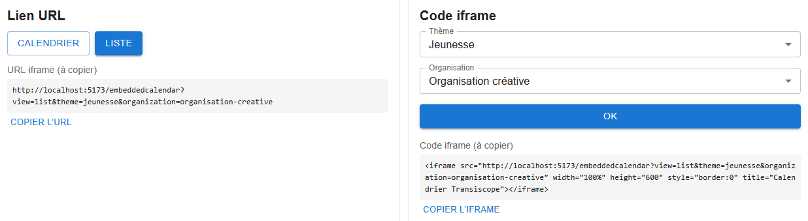

# Démo du calendrier intégré


## À quoi sert cette application ?
Cette démo permet de générer une iframe du calendrier embarqué (iframe) d'Archipelago / Transiscope afin d’intégrer les événements sur un site externe. Elle permet aussi de créer une URL prête à l’emploi, avec ou sans filtres, par thème, par organisation, ou les deux.

### Prérequis
- Node.js
- Yarn
- Le projet Archipelago / Transiscope doit être lancé (frontend + backend)

### Installation et démarrage :
L'application est autonome et indépendante du frontend principal, mais nécessite que le projet Archipelago / Transiscope soit lancé pour fonctionner correctement.

Installation des dépendances, à faire une seule fois :
```shell
cd archipelago/demo
yarn install
```
Démarrage de l’application :
```shell
yarn dev
```
Pour arrêter l’application :

`Ctrl + C`


Pour afficher l’aperçu utilisé par `EmbeddedCalendar.tsx`, il faut renseigner dans `demo/.env` l’URL du site Archipelago / Transiscope à utiliser.

Exemple en local :
```shell
VITE_FRONTEND_URL=http://localhost:5173/
```


### Utilisation de l’application
À l’ouverture, l’application affiche par défaut une vue **Calendrier**, sans filtre sélectionné.

L’interface est organisée en deux blocs :

| Bloc | Contenu |
| :-- | :-- |
| Bloc 1 | Lien URL et choix de la vue |
| Bloc 2 | Code iframe et filtres |

Ces deux blocs sont liés : les options sélectionnées dans l’un mettent à jour le résultat affiché dans l’autre.

##### Bloc 1 : lien URL et choix de la vue

Dans ce bloc, vous pouvez choisir entre deux vues :
- **Calendrier**
- **Liste**

Selon la vue sélectionnée, l’URL générée est mise à jour automatiquement et affichée sous les boutons.

Un bouton `Copier l’URL` permet de copier plus facilement.

##### Bloc 2 : code iframe et filtres

Dans ce bloc, vous pouvez générer le code de l’iframe avec deux filtres possibles :
- **Thème**
- **Organisation**

Ces filtres peuvent être utilisés séparément ou ensemble.
Après validation avec le bouton `OK`, le code de l’iframe est mis à jour selon la vue et les filtres choisis.

Un bouton `Copier l’iframe` permet ensuite de copier ce code plus facilement.

#### Exemple de résultat

Exemple d’URL générée :
```shell
http://localhost:5173/embeddedcalendar?view=list&theme=jeunesse&organization=organisation-creative
```
Exemple de code iframe généré :
```html
<iframe src="http://localhost:5173/embeddedcalendar?view=list&theme=jeunesse&organization=organisation-creative" width="100%" height="600" style="border:0" title="Calendrier Transiscope"></iframe>
```


#### Dépannage
Si l’aperçu ne s’affiche pas, vérifiez que :
- le frontend Archipelago / Transiscope est bien lancé ;
- la variable `VITE_FRONTEND_URL` dans `demo/.env` pointe vers la bonne URL.

### Exemple visuel
Capture sur les blocs de l'application :

Capture d'intégration de l'iframe sur une page html :


<!-- ### Fonctionnement global
- Le frontend affiche le calendrier via le composant `EmbeddedCalendar.tsx`
- Les paramètres dans l’URL (`view`, `theme`, `organization`) permettent de filtrer les événements
- Le frontend appelle l’API `/api/embeddedcalendar/events`
- Le backend récupère et filtre les événements selon les paramètres -->