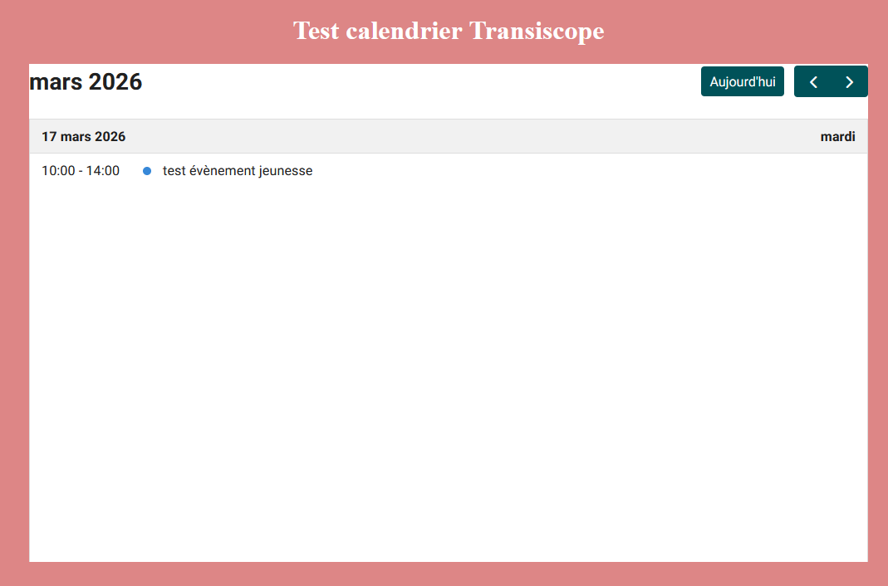

# Embedded Calendar Demo


## What is this application for?
This demo allows you to generate an iframe of the embedded Archipelago / Transiscope calendar in order to display events on an external website.
It also allows you to create a ready-to-use URL, with or without filters, by theme, by organization, or both.


### Prerequisites
- Node.js  
- Yarn  
- The Archipelago / Transiscope project must be running (frontend + backend)

### Installation and startup
The application is standalone and independent from the main frontend, but it requires the Archipelago / Transiscope project to be running in order to work properly.

Install dependencies (only once):
```shell
cd archipelago/demo
yarn install
```

Start the application:
```shell
yarn dev
```
To stop the application:

`Ctrl + C`


To display the preview used by `EmbeddedCalendar.tsx`, you need to set the URL of the Archipelago / Transiscope site to use in `demo/.env`.

Local example:
```shell
VITE_FRONTEND_URL=http://localhost:5173/
```


### Using the application
When opened, the application displays the **Calendar** view by default, with no filters selected.

The interface is organized into two sections:

| Section | Content |
| :-- | :-- |
| Section 1 | URL link and view selection |
| Section 2 | iframe code and filters |

These two sections are linked: the options selected in one update the result displayed in the other.

##### Section 1: URL link and view selection

In this section, you can choose between two views:
- **Calendar**
- **List**

Depending on the selected view, the generated URL is automatically updated and displayed below the buttons.

A `Copy URL` button makes it easier to copy.

##### Section 2: iframe code and filters

In this section, you can generate the iframe code with two possible filters:
- **Theme**
- **Organization**

These filters can be used separately or together.
After confirming with the `OK` button, the iframe code is updated according to the selected view and filters.

A `Copy iframe` button then lets you copy this code more easily.

#### Example output

Example of a generated URL:
```shell
http://localhost:5173/embeddedcalendar?view=list&theme=youth&organization=creative-organization
```
Example of generated iframe code:
```html
<iframe src="http://localhost:5173/embeddedcalendar?view=list&theme=youth&organization=creative-organization" width="100%" height="600" style="border:0" title="Transiscope Calendar"></iframe>
```


#### Troubleshooting
If the preview does not appear, check that:
- the Archipelago / Transiscope frontend is running;
- the `VITE_FRONTEND_URL` variable in `demo/.env` points to the correct URL.

### Visual example
Screenshot of the application's sections:

Screenshot of the iframe integrated into an HTML page:

